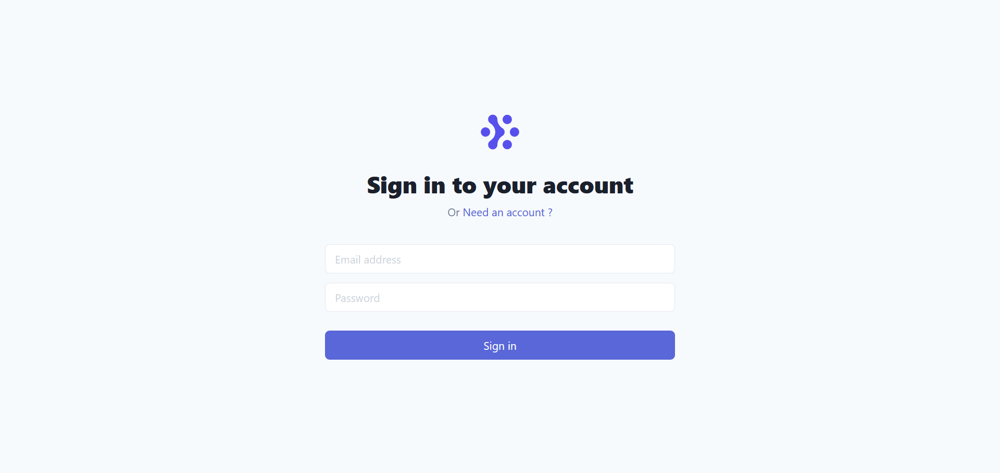
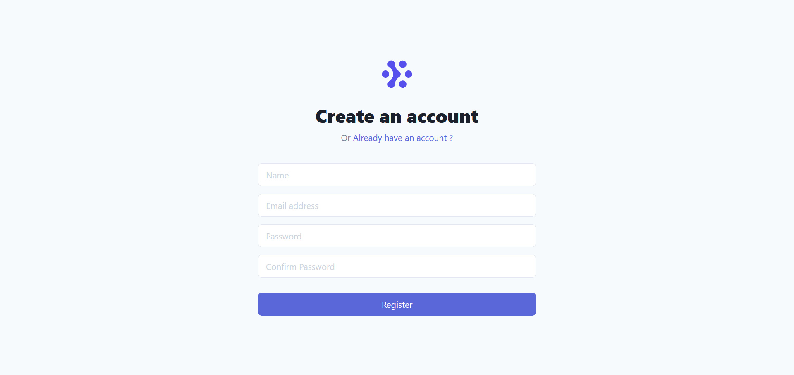
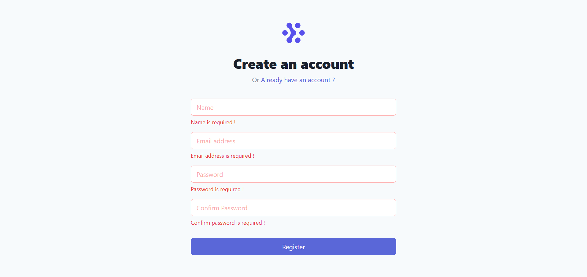
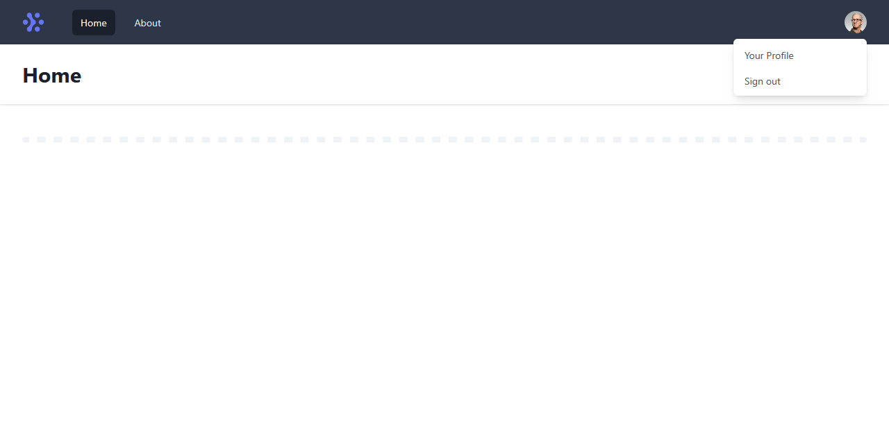
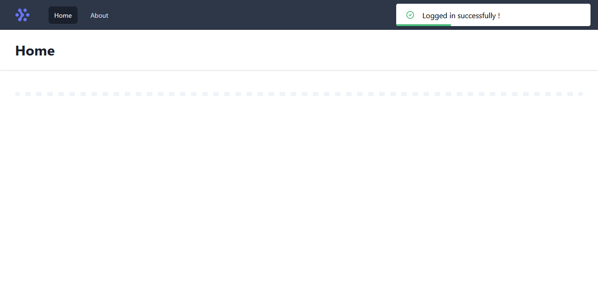
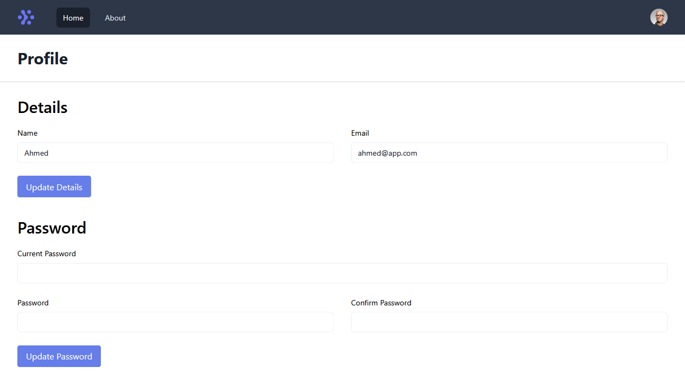

# Auth Boiler Plate (Client)

This is the frontend for [Auth Boiler Plate Backend](https://github.com/ahmed-riad-1/auth-boiler-plate-backend)

## Technologies used:

- [React Hook Form](https://github.com/react-hook-form/react-hook-form)
- [React Router DOM](https://github.com/ReactTraining/react-router/tree/master/packages/react-router-dom)
- [React Transition Group](https://github.com/reactjs/react-transition-group)
- [Axios](https://github.com/axios/axios)
- [JS Cookie](https://github.com/js-cookie/js-cookie)
- [Redux](https://redux.js.org/)
- [Context API](https://reactjs.org/docs/context.html)
- [Tailwind (only the cdn)](https://tailwindcss.com/)

## Screenshots:

Login

Register

Form Validation

Home

Alerts

Profile

